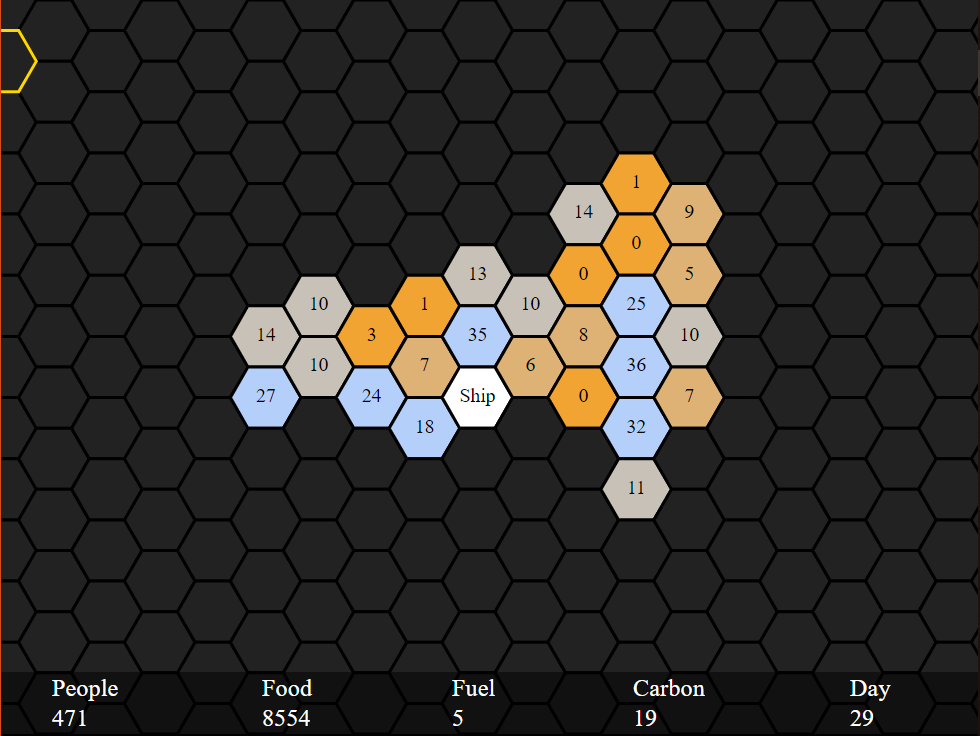

# Foreign Planet
### Made in under 48 hours for LD43 by Rialgar.

### [Play here](https://rialgar.github.io/LD43/index.xhtml)
### [Rate here](https://ldjam.com/events/ludum-dare/43/foreign-planet)

You have landed on a foreign planet. Your fuel is spent and your rations are limited.

To create new food or fuel you need to extract carbon from the planet and convert it. You can explore regions adjacent to already discovered regions or gather carbon from explored areas.

Gathering carbon in risky areas can result in casulties. If all crewmembers die, you lose.

Gathering carbon or exploring an area takes time. You need 1 food per 10 people to keep them alive each day.

If you manage to collect 1000 fuel, you can fly home.